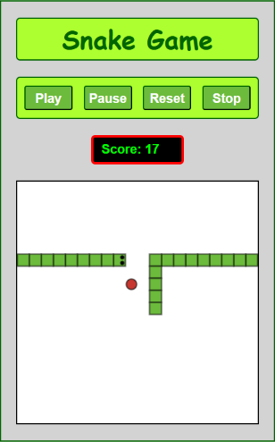

# Snake

The classic Snake game, built on top of the [Game GUI Framework](https://github.com/avikpln/game-gui-framework) as a demonstration of the framework's reusable game loop and rendering layer.

🎮 **[Play it live](https://avikpln.github.io/snake/)**



---

## The Game

Guide the snake around the board to eat the apples. Each apple eaten grows the snake by one segment and increases your score. The game ends if the snake runs into a wall or into itself.

---

## Tech Stack

- **JavaScript** — game logic and rendering, built on the [Game GUI Framework](https://github.com/avikpln/game-gui-framework)
- **HTML / CSS** — UI and layout

---

## Running Locally

```bash
git clone https://github.com/avikpln/snake.git
cd snake
open index.html   # or drag into your browser
```

---

## Project Structure

```
snake/
├── audio/
│   └── stroke.mp3
├── css/
│   └── styles.css
├── images/
│   ├── favicon.ico
│   ├── screenshot.png
│   └── snake.png
├── script/
│   ├── game/            # Snake game logic
│   │   ├── direction.js
│   │   ├── game.js
│   │   └── position.js
│   ├── gui/             # Graphical user interface
│   │   ├── canvas.js
│   │   ├── displayer.js
│   │   ├── events.js
│   │   ├── gui.js
│   │   └── timer.js
│   ├── lib/             # Shared utilities
│   │   ├── linkedlist.js
│   │   └── random.js
│   └── main.js
├── index.html
├── LICENSE
└── README.md
```
